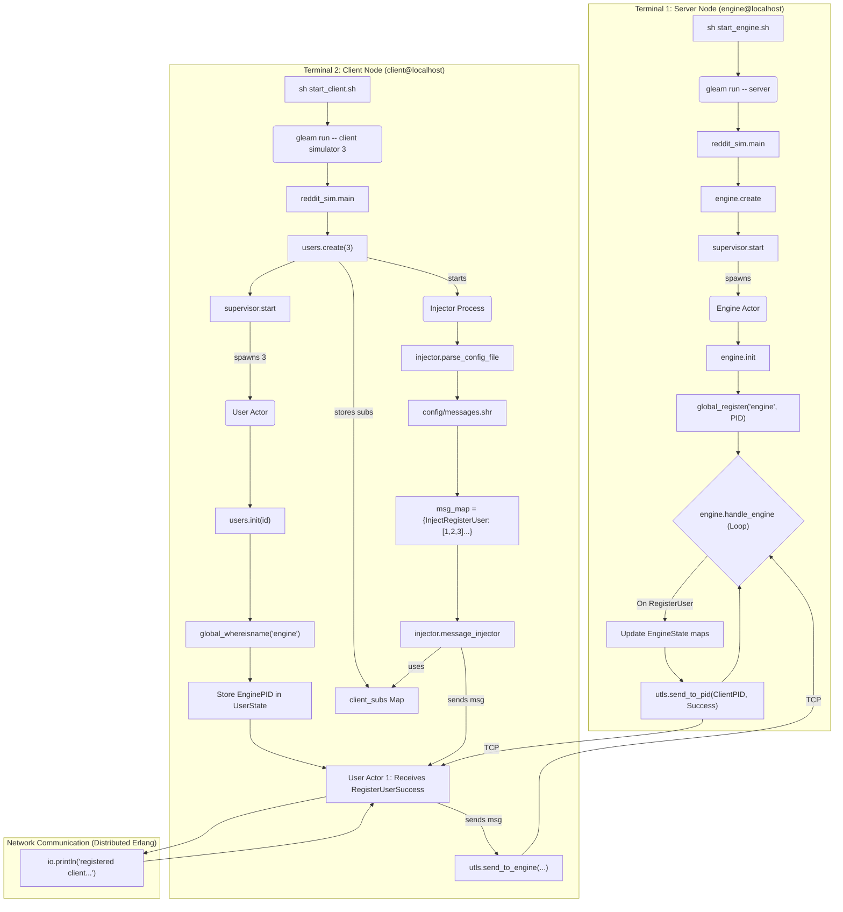

Reddit-Sim: A Distributed Reddit Simulator in Gleam

This project is an excellent demonstration of building a distributed, fault-tolerant application using Gleam and the underlying Erlang OTP framework. It simulates a basic Reddit-like system with a central server (the "engine") and multiple concurrent clients (the "users"). The entire system is built on the actor model, enabling robust state management and asynchronous communication between isolated processes.

## Core Concepts & Architectural Learnings

This project serves as a practical implementation of several fundamental principles of distributed systems and the OTP model:

* **Distributed Architecture (Erlang Nodes):** The application is not a single monolith. It's designed to run as two separate, named Erlang nodes: `engine@localhost` (the server) and `client@localhost` (the client simulator). These nodes communicate over the network using Erlang's built-in distribution protocol, all orchestrated by Gleam.
* **Actor Model (`gleam/otp/actor`):** Both the central server (`engine.gleam`) and each individual user (`users.gleam`) are implemented as OTP actors. This means:
    * **Encapsulated State:** The server's state (`EngineState`) and each user's state (`UserState`) are private to their respective actor processes. State can *only* be modified by the actor itself in response to a message.
    * **Asynchronous Message Passing:** All communication happens by sending immutable messages (e.g., `RegisterUser`, `CreateSubredditSuccess`). This eliminates the need for locks or mutexes, simplifying concurrency.
* **Service Discovery (`global`):** The engine actor, upon starting, registers its Process ID (PID) with the atom name `"engine"` in Erlang's `global` registry. When client actors start, they query this global registry (`global_whereisname`) to "find" the engine's PID, allowing them to communicate without a hardcoded address.
* **Fault Tolerance (`supervisor`):** Both the engine actor and the pool of user actors are started and managed by a `supervisor`. This is a cornerstone of OTP. If the engine actor crashes, the supervisor will automatically restart it, ensuring the service comes back online.
* **Simulation Driver (`injector.gleam`):** The `injector` process acts as a test harness or simulation driver. It parses a simple config file (`config/messages.shr`) and orchestrates the various client actors by sending them "inject" commands (e.g., "User 1, create a subreddit"). This is a powerful pattern for integration testing.
* **Stateful In-Memory Server:** The `EngineState` holds all application data (user metadata, subreddit metadata, posts) in in-memory `gleam/dict` maps. This makes the server extremely fast but non-persistent (all data is lost on restart). This is a classic trade-off, and for a production system, this actor would be backed by a database.

---

## Application Logic Flowchart

This flowchart illustrates the complete program flow, from initial launch to the message passing between the client actors, the injector, and the engine.

## How to Build and Run
Follow these steps to build and run the Reddit simulator on your local machine.

### Prerequisites
. Gleam: Install the Gleam compiler. (Project tested with 1.12.0)
. Erlang/OTP: Install the Erlang runtime. (Project tested with 27.1.2)

1. Build the Project
A build script is provided to handle code generation and compilation.

```Bash
sh build.sh
```

This script first runs the reddit-codegen/generate.sh script 
and then runs gleam clean and gleam build in the reddit-sim directory.

2. Run the Application
This application must be run in two separate terminal windows.

Terminal 1: Start the Engine (Server)
This terminal will run the central server process.

```Bash
# From the reddit-sim directory
sh start_engine.sh
```

This script starts an Erlang node named engine@localhost with the cookie test_cookie and runs the reddit_sim.main function in server mode. You will see a log message once it's registered, e.g., successfully registered.

Terminal 2: Start the Clients (Simulator)
This terminal will run the client simulator, which will spawn multiple user actors that connect to the engine.

```Bash
# From the reddit-sim directory
sh start_client.sh
```
This script starts a second Erlang node named client@localhost (with the same cookie) and runs reddit_sim.main in client simulator 3 mode.

You will immediately see output in both terminals as the clients are spawned, connect to the engine, and execute the actions defined in config/messages.shr.

## File & Module Breakdown
. src/reddit_sim.gleam: Main Entry Point. Parses command-line arguments to determine whether to run as a server or client, and with what parameters (simulator mode, num_users).

. src/server/engine.gleam: The Server. Contains the Engine actor logic. It initializes the EngineState and spends its life in the handle_engine message-processing loop, where it manages all user and subreddit data.

. src/client/users.gleam: The Client Supervisor. Spawns and supervises N User actors. Each User actor is a state machine that finds the engine, holds its own UserState (like its uuid after registration), and reacts to messages from both the injector and the engine.

. src/client/injector.gleam: The Simulator Driver. A single-purpose process that reads the config/messages.shr file, parses it into a map of actions and user IDs, and "injects" these command messages into the correct user actors.

. src/types.gleam: Core Data Structures. Defines the application's state models: UserState (for clients) and EngineState (for the server), which holds all user, subreddit, and post data.

. src/utls.gleam: Shared Utilities. Provides helper functions used by both client and server, most importantly send_to_engine (which uses global_send) and validate_request (for checking a user's uuid against their PID on the server).

. config/messages.shr: Simulation Script. A simple key-value file that dictates which users should perform which actions.

## Engineering Review & Future Improvements
. This project is a strong foundation. For a production-grade system, the next steps would involve addressing these key areas:

. Persistence: The EngineState is entirely in-memory. If the engine actor crashes and is restarted by its supervisor, all user and subreddit data is lost. The next step would be to back this state with a database. (e.g., Mnesia, a built-in Erlang DB, or an external DB like PostgreSQL).

. Scalability: The single Engine actor is a bottleneck. It must process every single request for the entire application serially. A more scalable design would involve multiple actors, perhaps one actor per subreddit, managed by a Registry (like gleam_otp's registry) to route messages to the correct process.

. Robust Error Handling: The code uses panic in several critical paths, such as failing to find the engine PID or failing to parse the config file. In a production system, these errors should be handled by returning a Result and allowing the calling process or supervisor to decide how to react (e.g., retry, log, or shut down).

. Authentication: The current auth model relies on the engine trusting that a message from a specific PID corresponds to a UUID it has on file. This is not secure. A real system would implement a login flow that returns a session token (e.g., a JWT) which would be passed with every authenticated request.
